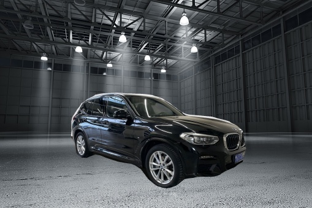
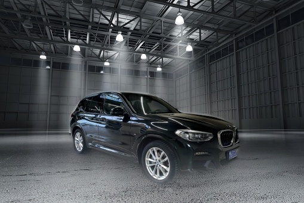
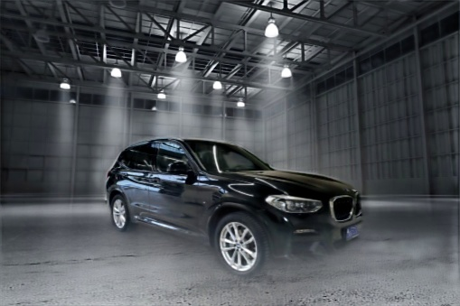

# Замена фона изображения

## 1. Отделение изображения автомобиля от фона

Для решения этой задачи я использовал предобученную модель *DeepLabV3* из
`torchvision`. Эта модель решает задачу семантической сегментации и обучена на
датасете *COCO*, где есть класс "автомобиль".

Маски создаются с помощью скрипта [get_masks.py](get_masks.py), затем они
обрабатываются с помощью [process_masks.py](process_masks.py). Обработка масок в
том числе нужна для удаления масок автомобилей, находящихся на заднем плане,
реализованный скрипт сохраняет только самую большую связную маску. Это не решает
проблему полностью -- если маски двух автомобилей перекрываются, то маска
фонового не удаляется. Более удачным способо решения проблемы было бы
использование нейросети, решающей задачу *instance segmentation*.

## 2. Вставка изображения на другой фон

Очевидно, что если просто добавлять вырезанное изображение на новый фон, то
результат получается не очень:

Для сглаживания границ я использовал классический метод склейки изображений с
помощью пирамид Лапласа. Пример результата:

Полученное изображение выглядит существенно лучше, хотя тоже совсем не идеально.

Другие изображения можно посмотреть в папке [output/blended](output/blended). Для
их получения использовался скрипт [insert_image.py](insert_image.py).

Скрипт [pipeline.sh](pipeline.sh) выполняет все операции первых двух пунктов.

## 3. Добавление тени

Здесь, к сожалению, ничего хорошего не получилось. Пример результата:

В целом задача добавления тени нетривиальная, я не слышал о готовых решениях.
Существуют DL-решения для детектирования и удаления теней, про решение обратной
задачи я не слышал.

Мой подход заключался в том, что я рассматривал задачу добавления тени как
исправление освещенности. Поэтому мой алгоритм действий был таков:

1. Берём датасет фотографий автомобилей (я взял Stanford Cars).
2. Переводим изображения в HSV, зашумляем value-канал, переводим обратно в RGB.
3. Обучаем U-Net (с предобученным backbone) восстанавливать из зашумлённого
изображения исходный value-канал.

Как видно из приведённой фотографии, ничего хорошего не получилось. Во-первых,
изображение замылилось. Это произошло из-за того, что я использовал в качестве
лосса MSE. Если дообучить получившуюся модель в режиме GAN, то от этой проблемы,
возможно, получится избавиться.

Во-вторых, что гораздо важнее, сеть не добавляет на изображение тень. Возможно,
это можно исправить, используя более хитрые пребразования value-канала, чем те,
что использовал я ("удаление" прямоугольника + белый шум). Например, можно
пропускать изображения через нейросеть для удаления теней
([пример](https://github.com/zhangbaijin/spa-former-shadow-removal)).
